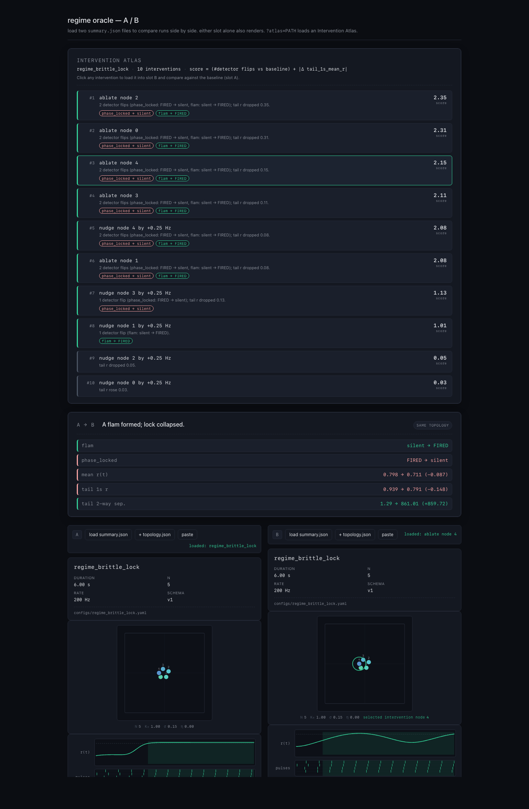
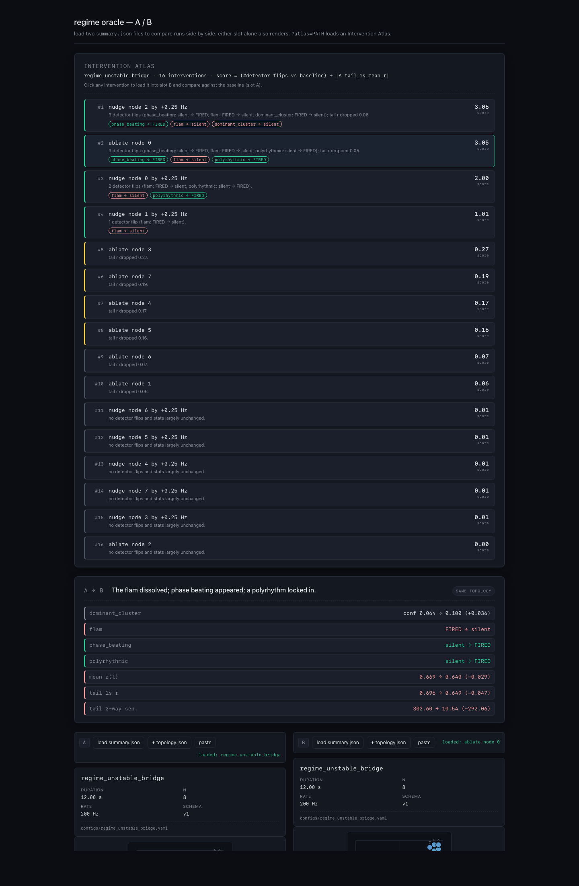

# Resonant Instrument Lab

A local research prototype for teaching small language models to **observe, describe, diagnose, and steer** emergent musical systems — starting from the raw continuous signals they produce.

## Why

Most music AI is evaluated by taste. Taste is slow, subjective, and unfalsifiable for a single researcher. This project swaps the target: we work in a **bounded synthetic world** — a Coupled Oscillator Garden — whose dynamics are known and whose semantic labels (*phase-locked*, *groove*, *brittle lock*, *tension break*, and so on) are computable directly from state.

The headline evaluation principle is **intervention grounding**:

> When the model proposes a change, we *apply that change* in the simulator. Did the world move the way the model said it would?

That turns *"does the model understand?"* into a test a laptop can run.

## What v0 is

- A coupled-oscillator simulator with pulse-driven audio and detector-grounded labels.
- A small instruction-tuned model — encoders + frozen base LM + LoRA adapters — that learns to caption, compare, diagnose, and suggest single interventions.
- Fully local, reproducible from seeds, no third-party audio data.

## Current milestone

**Simulator + ground-truth detectors + dataset dump. No model code yet.**

Detectors are the hardest part of the project and must pass a human sniff test before any training is meaningful. Acceptance criteria for this milestone live in [`DESIGN_V0.md §9`](./DESIGN_V0.md#9-first-coding-milestone).

## Intervention Atlas

The headline browser artifact. For a single baseline run, the atlas enumerates every single-node intervention the simulator currently exposes through `sim.ablate` — `ablate_node(k)` and `nudge_node(k, +0.25 Hz)` for each `k ∈ [0, N)` — re-simulates each one, and ranks them by how much they move the detector verdicts away from baseline. The browser view is a ranked list + an A/B comparison per click: slot A stays pinned to the baseline, slot B swaps in the intervention's summary, and the comparison card's one-line takeaway + detector-flip diff updates live.

Score is deliberately simple and explainable in one sentence: `(#detector flips vs baseline) + |Δ tail_1s_mean_r|`. Flips dominate (each crosses a named semantic boundary like `phase_locked → silent` or `flam → FIRED`); the tail-r delta is the natural tiebreaker and is the visible signal on no-flip interventions. Each row carries a plain-English explanation of its score ("2 detector flips; tail r dropped 0.35."), and the left-edge color band (green / amber / dim) lets the eye locate the interesting entries first.



*Atlas for `regime_brittle_lock` (N=5, baseline phase-locks at r ≈ 0.94). Every single-node ablation breaks the lock and creates a flam pair (score ≈ 2); the four nudge interventions split cleanly into "brittle" (nodes 3, 4) and "robust" (nodes 0, 1, 2) — the same brittle-node identity `detect_brittle_lock` reports, but surfaced as an interventional ranking rather than a single field.*



*Atlas for `regime_unstable_bridge` (N=8, a three-node bridge + two-spoke structure plus a distractor cluster). `ablate node 0` — the bridge itself — lands near the top with 3 flips (`flam → silent`, `phase_beating → FIRED`, `polyrhythmic → FIRED`). The comparison card's takeaway ("The flam dissolved; phase beating appeared; a polyrhythm locked in.") reads the bridge-collapse story off the topology card for the first time without needing to trace node indices by hand.*

### Why it matters

A baseline detector verdict answers *"what is this run?"*. The atlas answers *"what would it take to make it something else?"* — which node do you have to remove to collapse the cluster, which one do you have to detune to break the lock. That's the intervention-grounding principle of the project made visible for one run, in the browser, with no backend and no model.

### Hearing the intervention

Each run now emits an audible `audio.wav` alongside the existing bundle: one short pitched click per pulse in `pulse_fired`, pitched as `180 + 80·ω₀ Hz` so nodes are distinguishable and a `nudge_node(+0.25 Hz)` shifts the nudged node's pitch audibly (no RNG — the synthesis is deterministic, so `(config + seed + intervention) → byte-identical WAV`). The atlas builder persists each intervention's audio into a sibling `atlas_audio/<intervention_id>.wav`, referenced by `audio_path` on each atlas entry. In the browser, picking an intervention exposes a compact A / B playback strip under the comparison card — **play A** (baseline), **play B** (intervention), and **swap A ↔ B** which crossmutes two sync'd audio elements so you hear the flip without losing position. Graceful fallback: if `audio_path` is missing or fails to load, the corresponding play button disables itself.

### Launch it

`./run.sh` — creates `.venv` if needed, regenerates every fixture's demo artifacts (including `atlas.json` per fixture), prints copy-pasteable browser URLs, and starts a static server on `http://localhost:8000`. `PORT=9000 ./run.sh` overrides the port; Ctrl-C stops the server. The two atlas URLs print first. Deep-link to a specific intervention via `&select=ablate_n4` (or any intervention `id`) — the same mechanism the screenshots above were captured with.

## Try it


*Left: ensemble phase-locks (r ≈ 1 flat, all pulses aligned). Right: two coherent sub-groups lock separately, so global coherence oscillates and the pulse raster splits into two rhythms. The oracle fires `phase_locked` on the left and `dominant_cluster` on the right; the comparison takeaway is auto-generated.*

Eight regime fixtures already run end-to-end. Each produces a full `state.npz` / `events.jsonl` / `topology.json` / `audio.wav` / frozen `config.yaml` bundle, plus — with `--summary` — a compact semantic verdict from the current detectors:

```
$ python scripts/run_sim.py --config configs/regime_locked.yaml --out runs/demo/locked --summary
ok: wrote run artifacts to runs/demo/locked

regime summary — configs/regime_locked.yaml
  6.00 s, N=8, control_rate=200 Hz

  phase_locked    : FIRED   conf 0.094   longest window 5.73 s
  drifting        : silent
  phase_beating   : silent
  flam            : silent
  polyrhythmic    : silent
  dominant_cluster: silent
  unstable_bridge : silent
  brittle_lock    : silent

  mean r(t)                    0.981
  tail-1s r                    0.995
  tail 2-way velocity sep.     0.00
```

Swap the config for `configs/regime_drifting.yaml` and `drifting` fires instead; swap for `configs/regime_two_cluster.yaml` and `dominant_cluster` fires on the clean 4+4 velocity split with both sub-groups internally locked, while the tail 2-way velocity separability jumps to ~700; swap for `configs/regime_phase_beating.yaml` and `phase_beating` fires on the near-frequency pair inside an otherwise-incoherent field; swap for `configs/regime_flam.yaml` and `flam` fires on the frequency-locked near-unison pair; swap for `configs/regime_polyrhythmic.yaml` and `polyrhythmic` fires on the 2:3 pulse-rate ratio; swap for `configs/regime_unstable_bridge.yaml` and `unstable_bridge` (the first counterfactual detector) fires on a bridge-held 3-node cluster whose coherence vanishes when the central bridge node is ablated — the detector proves this by running `sim.ablate.ablate_node` on every cluster member internally and flagging the nodes whose removal collapses surviving-member `local_r` below 0.9; swap for `configs/regime_brittle_lock.yaml` and `brittle_lock` (the second counterfactual detector) fires on a marginal 5-node phase-lock whose outer-ω nodes break under a +0.25 Hz whole-run frequency nudge — the detector proves this by running `sim.ablate.nudge_node` on every node internally and flagging the nodes whose nudged run drops tail-r below 0.9. Detector thresholds and window sizes live inline in `sim/detectors.py`; confidence is evidence margin above/below the threshold, not a probability.

Add `--summary-json` to also write the same verdicts and stats to `summary.json` in the output directory — a machine-readable seam for programmatic / browser consumers. Both views are rendered from one shared builder so they cannot drift.

For a browser-friendly rendering of any `summary.json`, open `demo/index.html`. The demo has two slots (A and B): picking a file into each shows both summaries side by side plus a detector-flip / stat-delta comparison card with a one-line takeaway (e.g. *"A dominant cluster formed; lock collapsed."*). Each slot renders three cards that ground the semantics in the underlying physics:

- a **topology card** — node positions in the unit square, frequency-tinted dots, an `N · K₀ · σ · η` footer — fetched from a sibling `topology.json` next to the loaded summary;
- a **dynamics card** — `r(t)` sparkline with the `r = 0.9` lock line marked and a pulse raster across all N nodes. Fired-detector windows (from `summary.json`) are drawn as translucent accent bands behind both traces, so the reader sees *when* the named regime held;
- one **detector card** per detector (fired/silent, confidence, longest window) plus a small stats block.

When both slots have topologies a `same topology` / `different topology` badge appears on the comparison card. Serve the repo with `./run.sh` (or `python -m http.server`) and navigate to `http://localhost:8000/demo/index.html?summaryA=../runs/demo/locked/summary.json&summaryB=../runs/demo/two_cluster/summary.json` to auto-load both. Vanilla HTML/CSS/JS, no build step.

## Counterfactual (intervention) runs

The project's headline evaluation principle — intervention grounding — rests on being able to re-run the simulator under a different intervention and compare. The surface is `sim.ablate`, currently with two narrow siblings by design: `ablate_node` (decouple-and-silence) and `nudge_node` (detune-in-place). These are the two primitives the Intervention Atlas enumerates.

```
$ python scripts/run_ablation.py --config configs/regime_two_cluster.yaml \
      --out runs/demo/two_cluster.ablate_n0 --node 0 --summary
```

Semantics for node ablation are *decouple-and-silence*: the ablated node is removed from the coupling graph (every `K[k, j]` and `K[j, k]` is zeroed for the whole run) and its pulses are force-silenced in `pulse_fired`. Its `theta` keeps integrating at its natural frequency so the `(T, N)` artifact contract is preserved — but since the node is causally detached, the *other* nodes' trajectories are the honest counterfactual "what would have happened without node k". Semantics for node nudge are *detune-in-place*: the node's natural frequency is shifted by `delta_hz` for the whole run while coupling, noise, and everything else is preserved — the network still has every chance to recapture the detuned node, so the surviving coherence measures lock elasticity rather than causal removal. Each intervention writes the same artifact set as a baseline run plus a small `ablation.json` / `nudge.json` manifest documenting what was changed and under what semantics; baseline runs emit neither, so the presence of one of those files is itself the marker "this is a counterfactual bundle". Determinism: `(config + seed + intervention)` → byte-identical artifacts. Arbitrary interventions (mid-run ablation, edge ablation, topology edits, combined ablate+nudge) are deferred — each new counterfactual detector earns one narrow sibling seam here.

## Docs

- [`DESIGN_V0.md`](./DESIGN_V0.md) — full v0 design note.
- [`DIRECTORS_NOTES.md`](./DIRECTORS_NOTES.md) — project canon and append-only pivot log.

## Status

v0, simulator + eight detectors (six observational + two counterfactual via `sim.ablate`) + eight regime fixtures + Intervention Atlas v1 landed. No model code yet.
