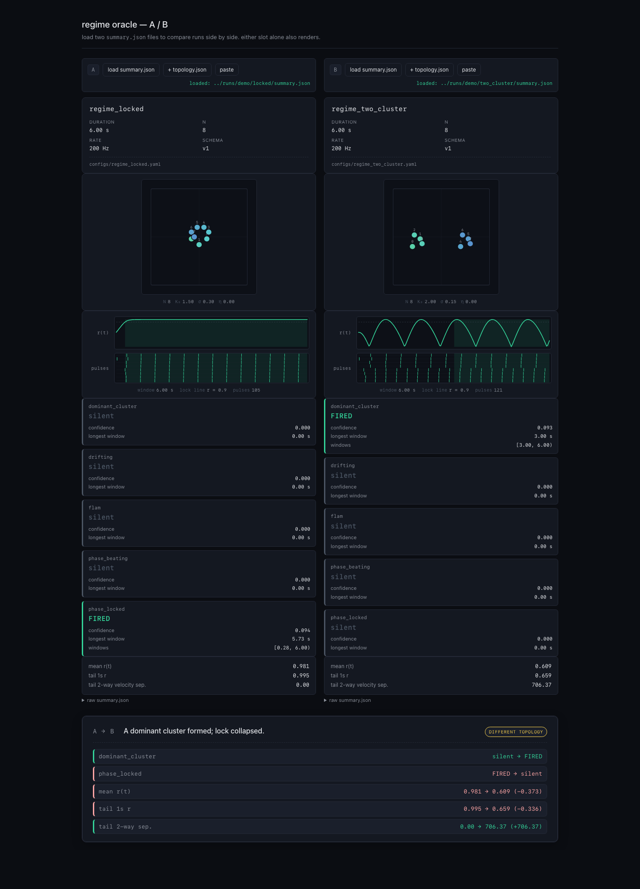

# Resonant Instrument Lab

A local research prototype for teaching small language models to **observe, describe, diagnose, and steer** emergent musical systems — starting from the raw continuous signals they produce.

## Why

Most music AI is evaluated by taste. Taste is slow, subjective, and unfalsifiable for a single researcher. This project swaps the target: we work in a **bounded synthetic world** — a Coupled Oscillator Garden — whose dynamics are known and whose semantic labels (*phase-locked*, *groove*, *brittle lock*, *tension break*, and so on) are computable directly from state.

The headline evaluation principle is **intervention grounding**:

> When the model proposes a change, we *apply that change* in the simulator. Did the world move the way the model said it would?

That turns *"does the model understand?"* into a test a laptop can run.

## What v0 is

- A coupled-oscillator simulator with pulse-driven audio and detector-grounded labels.
- A small instruction-tuned model — encoders + frozen base LM + LoRA adapters — that learns to caption, compare, diagnose, and suggest single interventions.
- Fully local, reproducible from seeds, no third-party audio data.

## Current milestone

**Simulator + ground-truth detectors + dataset dump. No model code yet.**

Detectors are the hardest part of the project and must pass a human sniff test before any training is meaningful. Acceptance criteria for this milestone live in [`DESIGN_V0.md §9`](./DESIGN_V0.md#9-first-coding-milestone).

## Try it



*Left: ensemble phase-locks (r ≈ 1 flat, all pulses aligned). Right: two coherent sub-groups lock separately, so global coherence oscillates and the pulse raster splits into two rhythms. The oracle fires `phase_locked` on the left and `dominant_cluster` on the right; the comparison takeaway is auto-generated.*

One-liner launcher: `./run.sh` creates a `.venv` if needed, regenerates demo artifacts for every fixture under `runs/demo/`, prints copy-pasteable browser URLs (including a `locked` vs `two_cluster` comparison that shows the `dominant_cluster` detector flip), and starts a static server on `http://localhost:8000`. `PORT=9000 ./run.sh` overrides the port; Ctrl-C stops the server.

Seven regime fixtures already run end-to-end. Each produces a full `state.npz` / `events.jsonl` / `topology.json` / `audio.wav` / frozen `config.yaml` bundle, plus — with `--summary` — a compact semantic verdict from the current detectors:

```
$ python scripts/run_sim.py --config configs/regime_locked.yaml --out runs/demo/locked --summary
ok: wrote run artifacts to runs/demo/locked

regime summary — configs/regime_locked.yaml
  6.00 s, N=8, control_rate=200 Hz

  phase_locked    : FIRED   conf 0.094   longest window 5.73 s
  drifting        : silent
  phase_beating   : silent
  flam            : silent
  polyrhythmic    : silent
  dominant_cluster: silent
  unstable_bridge : silent

  mean r(t)                    0.981
  tail-1s r                    0.995
  tail 2-way velocity sep.     0.00
```

Swap the config for `configs/regime_drifting.yaml` and `drifting` fires instead; swap for `configs/regime_two_cluster.yaml` and `dominant_cluster` fires on the clean 4+4 velocity split with both sub-groups internally locked, while the tail 2-way velocity separability jumps to ~700; swap for `configs/regime_phase_beating.yaml` and `phase_beating` fires on the near-frequency pair inside an otherwise-incoherent field; swap for `configs/regime_flam.yaml` and `flam` fires on the frequency-locked near-unison pair; swap for `configs/regime_polyrhythmic.yaml` and `polyrhythmic` fires on the 2:3 pulse-rate ratio; swap for `configs/regime_unstable_bridge.yaml` and `unstable_bridge` (the first counterfactual detector) fires on a bridge-held 3-node cluster whose coherence vanishes when the central bridge node is ablated — the detector proves this by running `sim.ablate.ablate_node` on every cluster member internally and flagging the nodes whose removal collapses surviving-member `local_r` below 0.9. Detector thresholds and window sizes live inline in `sim/detectors.py`; confidence is evidence margin above/below the threshold, not a probability.

Add `--summary-json` to also write the same verdicts and stats to `summary.json` in the output directory — a machine-readable seam for programmatic / browser consumers. Both views are rendered from one shared builder so they cannot drift.

For a browser-friendly rendering of any `summary.json`, open `demo/index.html`. The demo has two slots (A and B): picking a file into each shows both summaries side by side plus a detector-flip / stat-delta comparison card with a one-line takeaway (e.g. *"A dominant cluster formed; lock collapsed."*). Each slot renders three cards that ground the semantics in the underlying physics:

- a **topology card** — node positions in the unit square, frequency-tinted dots, an `N · K₀ · σ · η` footer — fetched from a sibling `topology.json` next to the loaded summary;
- a **dynamics card** — `r(t)` sparkline with the `r = 0.9` lock line marked and a pulse raster across all N nodes. Fired-detector windows (from `summary.json`) are drawn as translucent accent bands behind both traces, so the reader sees *when* the named regime held;
- one **detector card** per detector (fired/silent, confidence, longest window) plus a small stats block.

When both slots have topologies a `same topology` / `different topology` badge appears on the comparison card. Serve the repo with `./run.sh` (or `python -m http.server`) and navigate to `http://localhost:8000/demo/index.html?summaryA=../runs/demo/locked/summary.json&summaryB=../runs/demo/two_cluster/summary.json` to auto-load both. Vanilla HTML/CSS/JS, no build step.

## Counterfactual (ablation) runs

The project's headline evaluation principle — intervention grounding — rests on being able to re-run the simulator under a different intervention and compare. The first such surface is `sim.ablate`, currently narrow by design:

```
$ python scripts/run_ablation.py --config configs/regime_two_cluster.yaml \
      --out runs/demo/two_cluster.ablate_n0 --node 0 --summary
```

Semantics for node ablation are *decouple-and-silence*: the ablated node is removed from the coupling graph (every `K[k, j]` and `K[j, k]` is zeroed for the whole run) and its pulses are force-silenced in `pulse_fired`. Its `theta` keeps integrating at its natural frequency so the `(T, N)` artifact contract is preserved — but since the node is causally detached, the *other* nodes' trajectories are the honest counterfactual "what would have happened without node k". The ablated run writes the same artifact set as a baseline run plus a small `ablation.json` manifest documenting which nodes were ablated and under what semantics; baseline runs never emit `ablation.json`, so its presence is the marker "this is a counterfactual bundle". Determinism: `(config + seed + ablated_nodes)` → byte-identical artifacts. Arbitrary interventions (mid-run ablation, edge ablation, topology edits) are deferred — this is the narrowest honest scaffold for the counterfactual-detector layer to build on.

## Docs

- [`DESIGN_V0.md`](./DESIGN_V0.md) — full v0 design note.
- [`DIRECTORS_NOTES.md`](./DIRECTORS_NOTES.md) — project canon and append-only pivot log.

## Status

v0, simulator + seven detectors (six observational + one counterfactual via `sim.ablate`) + seven regime fixtures landed. No model code yet.
